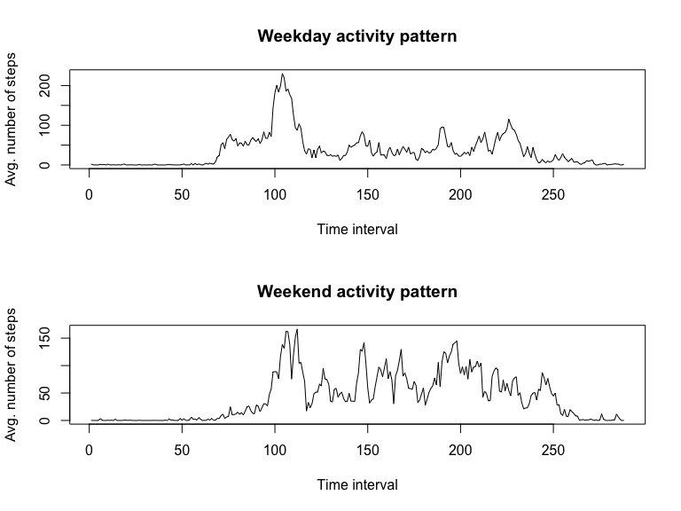

# Reproducible Research: Peer Assessment 1


## Loading and preprocessing the data


```r
    unzip("activity.zip")
    data <- read.csv("activity.csv")
```

## What is mean total number of steps taken per day?


```r
    stepsPerDay <- tapply(data$steps, data$date, sum)
    hist(stepsPerDay, xlab = "Total number of steps taken per day", ylab = "Frequency", main = "Total Steps Per Day")
```

<!-- -->

```r
    StepsPerDay_Mean <- mean(stepsPerDay, na.rm = TRUE)
    StepsPerDay_Median <- median(stepsPerDay, na.rm = TRUE)
```
The mean of the total number taken per day is 1.0766189\times 10^{4} and the Median is 10765.

## What is the average daily activity pattern?


```r
    activityPattern <- tapply(data$steps, data$interval, mean, na.rm = TRUE)
    plot(activityPattern, type = "l", xlab = "Time interval", ylab = "Avg. number of steps across all days", main = "Daily activity pattern")
```

<!-- -->

```r
    maxInterval <- activityPattern[which(max(activityPattern) == activityPattern)]
    maxInterval <- names(maxInterval)
```

The 5-minute interval that contains, on average across all the days in the dataset,  the maximum number of steps is 835.

## Imputing missing values


```r
    NAsum <- sum(is.na(data))
```

The total number of missing values in the dataset is 2304.  
To fill in the missing values I use the average steps count for the same 5-minute interval.


```r
    newData <- data
    newData[is.na(newData), "steps"] <- activityPattern[as.character(newData[is.na(newData), "interval"])]
    stepsPerDay_new <- tapply(newData$steps, newData$date, sum)
    hist(stepsPerDay_new, xlab = "Total number of steps taken per day", ylab = "Frequency", main = "Total Steps Per Day (after imputing missing values)")
```

<!-- -->

```r
    StepsPerDay_Mean_new <- mean(stepsPerDay_new, na.rm = TRUE)
    StepsPerDay_Median_new <- median(stepsPerDay_new, na.rm = TRUE)
```

After imputing missing values the mean of the total number taken per day is 1.0766189\times 10^{4} and the Median is 1.0766189\times 10^{4}.  
Imputing the missing values had no impact on the mean and increased the median a little bit.

## Are there differences in activity patterns between weekdays and weekends?


```r
    newData$date <- strptime(newData$date, "%Y-%m-%d")
    newData$weekDay = weekdays(newData$date)
    dayCat <- character(length = nrow(newData))
    for (i in 1:length(dayCat)) {
        dayCat[i] <- {
            if (newData[i, "weekDay"] == "Saturday" || newData[i, "weekDay"] == "Sunday") {
                "weekend"
            } else {
                "weekday"
            }
        }
    }
    dayCat <- as.factor(dayCat)
    newData <- cbind(newData, dayCat)
    weekday <- newData[newData$dayCat == "weekday",]
    weekdayActivity <- tapply(weekday$steps, weekday$interval, mean, na.rm = TRUE)
    weekend <- newData[newData$dayCat == "weekend",]
    weekendActivity <- tapply(weekend$steps, weekend$interval, mean, na.rm = TRUE)
    par(mfrow = c(2,1))
        plot(weekdayActivity, type = "l", xlab = "Time interval", ylab = "Avg. number of steps", main = "Weekday activity pattern")
        plot(weekendActivity, type = "l", xlab = "Time interval", ylab = "Avg. number of steps", main = "Weekend activity pattern")
```

<!-- -->
